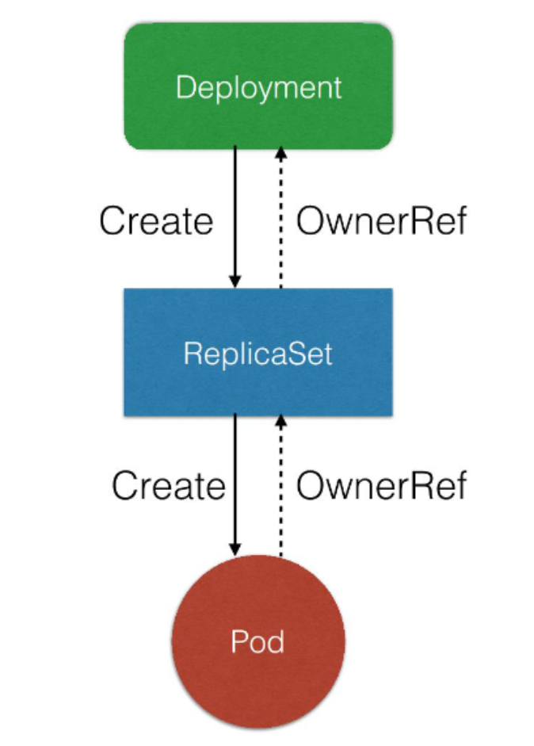

 Deployment是k8s中用来管理发布的控制器，在开发的过程中使用非常频繁，本篇文章主要介绍deployment相关的使用和原理。
## Deployment的作用
- 定义一组pod的期望数量，controller会维持Pod的数量和期望的一致（其实deployment是通过管理rs的状态来间接管理pod)
- 配置Pod的发布方式，controller会按照给定的策略去更新pod资源，以此来保证更新过程中可用的pod数量和不可用的pod数量都在限定范围内。（MaxUnavailable以及MaxSurge字段）
- 支持回滚操作，可记录多个前置版本（数量可通过配置设置revisionHistoryLimit）

## 主要字段说明
    apiVersion: apps/v1
    kind: Deployment
    metadata: #Deployment元数据
      labels:
        app: kubernetes-bootcamp-v1
      name: kubernetes-bootcamp-v1
    spec: 
      replicas: 2 #期望的Pod数量
      selector:
        matchLabels:
          app: kubernetes-bootcamp-v1 #Pod选择器
      template: #Pod模板
        metadata:
          labels:
            app: kubernetes-bootcamp-v1
        spec:
          containers:
          - image: jocatalin/kubernetes-bootcamp:v1
            name: kubernetes-bootcamp-v1

## 使用kubectl apply创建Deployment资源:

    # kubectl  apply -f kubernetes-bootcamp-v1.yaml
    deployment.apps/kubernetes-bootcamp-v1 created
   ### 验证 
    # kubectl  get pod
    NAME                                     READY   STATUS        RESTARTS   AGE
    kubernetes-bootcamp-v1-c5ccf9784-m79vt   1/1     Running       0          3s
    kubernetes-bootcamp-v1-c5ccf9784-5blct   1/1     Running       0          3s
 
    