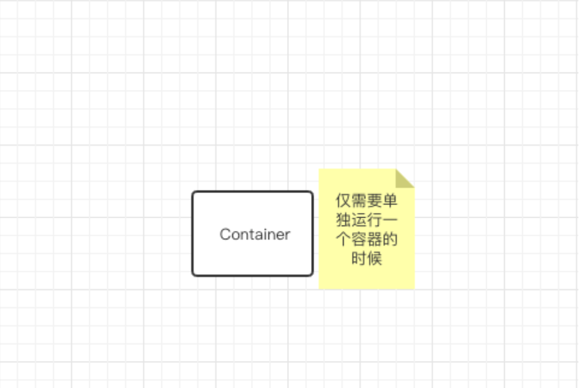
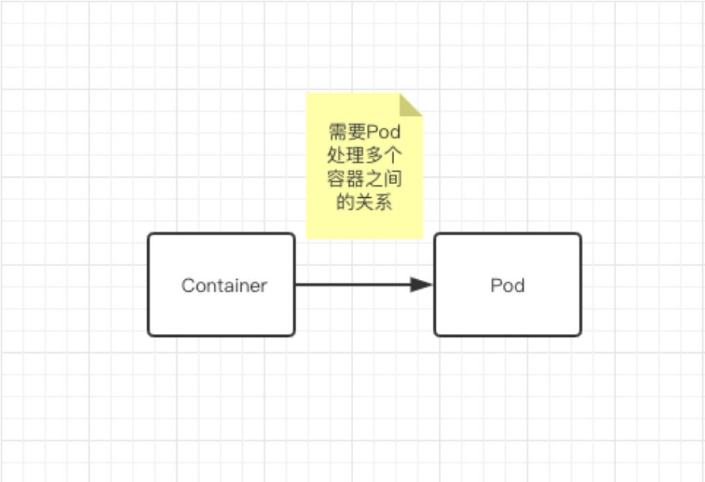
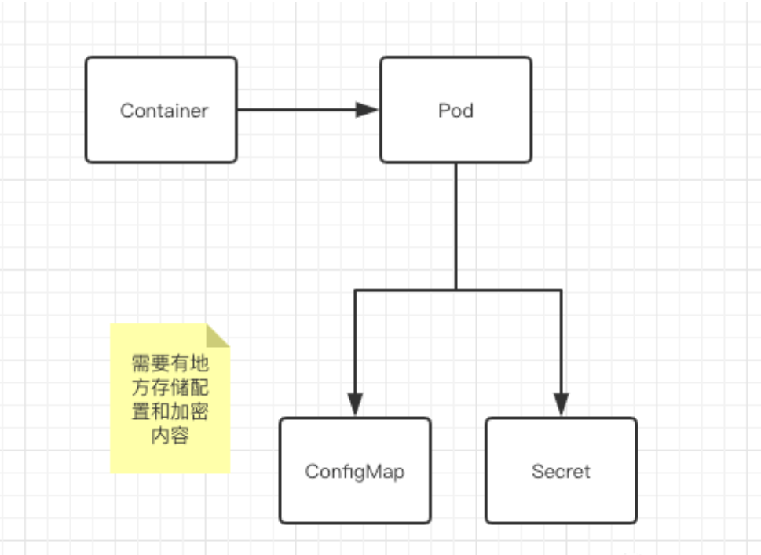
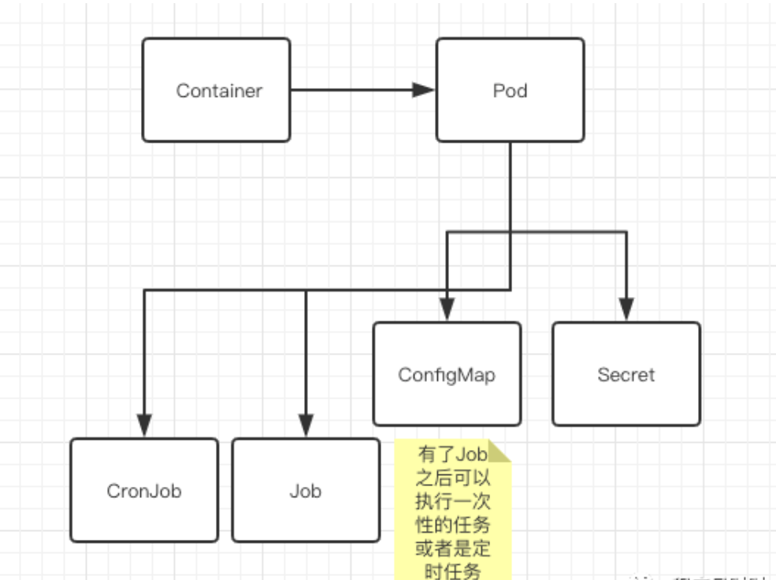
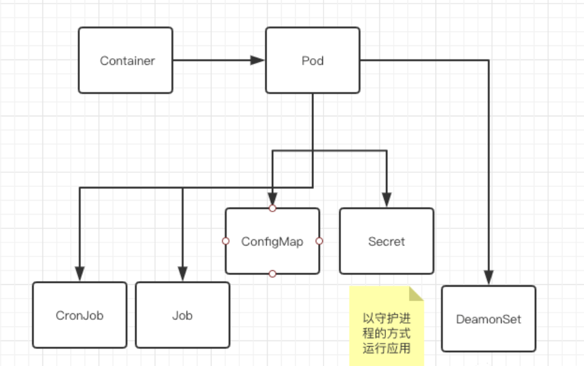
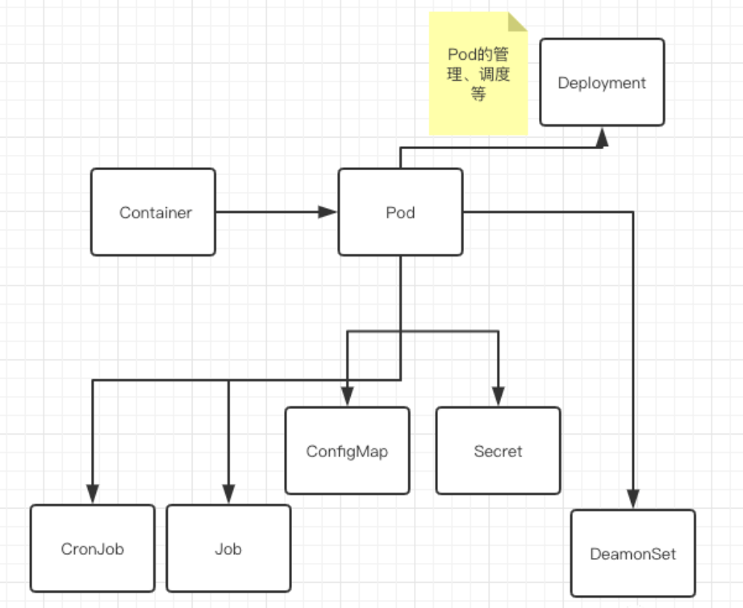
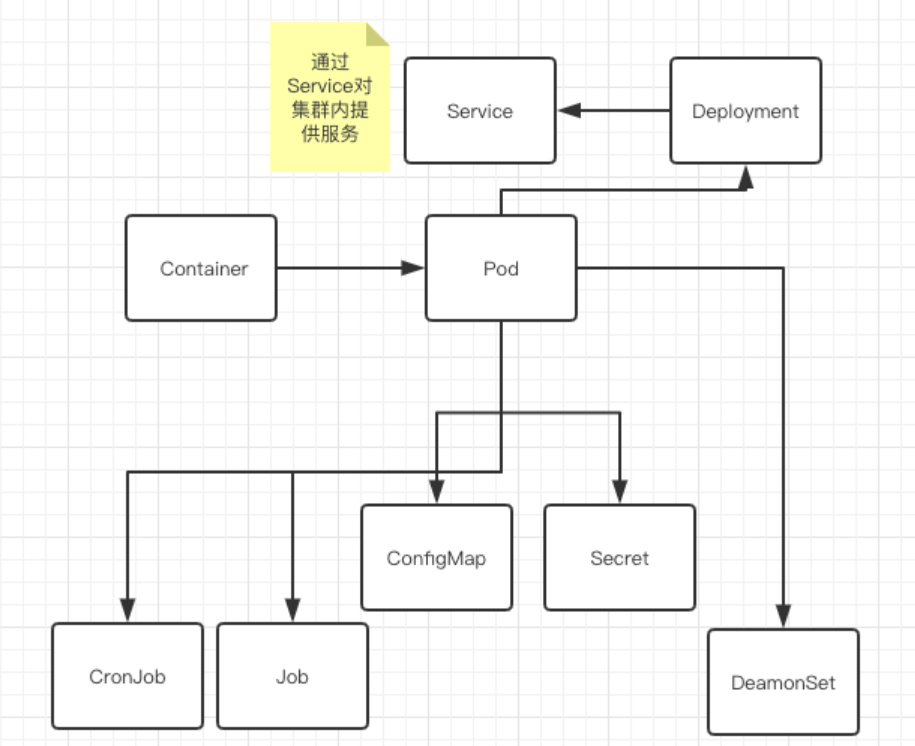
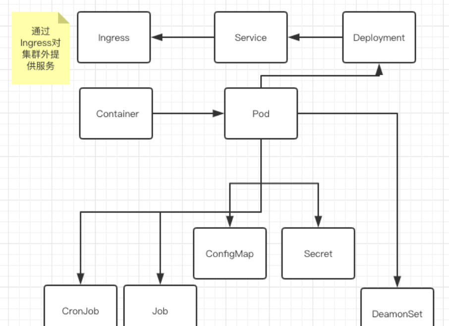

## 通过Pod终结单容器的蛮荒时代

在接触K8s之前，大多人首先要接触到的就是Docker。我们得到一个容器的镜像之后，要把应用运行起来
最简单的方式就是docker run的命令。然而在实际的生产环境中，很少仅靠一个单容器就能够满足。比如
，一个Web前端的应用，可能还得依赖后端的一个容器服务；后端的容器可能需要数据库服务；后端的服务需要多副本等等场景。
在这些假想的场景中，比较真实的需求就是这些容器应用需要共享同一个网络栈，同一个存储卷等，还有它们的生命周期如何管理调度。
这个时候，仅仅依靠容器无法解决这个问题，我们第一个选手Pod就闪亮登场了。

## Pod 内共享配置
有了Pod之后，同一个Pod内的容器可以共享很多信息，也可能需要读取同一份配置。比如Pod内有两个容器需要访问同一个数据库
，那么我们可以把相关的配置信息写到ConfigMap里。那如果还有一些比较敏感的信息的话，就需要放到Secret对象中，
它其实是一个保存在 Etcd 里的键值对数据。这样，你把 Credential 信息以 Secret 的方式存在 Etcd 里，Kubernetes
 就会在你指定的 Pod（比如，Web 应用的 Pod）启动时，自动把 Secret 里的数据以 Volume 的方式挂载到容器里。
 

## 任务和定时任务
有了Pod之后，事情就变得更清晰了。在集群内，我们可能会有多种形式的要求。比如，我们可能
希望一个应用每天固定时间运行或者只允许运行一次，可能希望某个应用以守护进程的方式运行。在K8s里，
自然也有方案来解决这些问题。
 
首先来看定时任务的需求，假设我的系统内有一个全网信息排行榜展示，要求每天需要在凌晨0点的
时候更新一次。这个需求在K8s里就可以用CronJob来搞定。而如果仅仅需要执行一次的任务，那就直接使用Job对象就可以了。 

## 默默工作的DaemonSet
再接下来，可能需要以守护进程的方式运行一个应用。比如，我想要在后台进行日志的收集。这个
时候DaemonSet就派上了用场，它会保证在所有的目标节点上运行一个Pod的副本。在这期间，如
果有新的Node加入到K8s集群中的话，它也会自动完成调度，在新的机器上运行一个Pod副本。因
此，前面说的监控、日志等任务很适合用DaemonSet的方式执行。

## Deployment管理Pod
说完DaemonSet，下一个重点Deployment来了。前面说过容器之间的关联关系、共享资源
等问题需要处理，从而引入了Pod。对于Pod，也是同样的问题需要解决，只不过高了一个抽象层次罢了。
因为面临Pod的生命周期管理、调度、多副本等问题需要解决，聪明的设计者引入了Deployment。它可以
根据我们的需求（比如通过标签）将Pod调度到目标机器上，调度完成之后，它还会继续帮我们继续监控容器是否在正确运行，
一旦出现问题，会立刻告诉我们Pod的运行不正常以及寻找可能的解决方案，比如目标节点不可用的时候它可以快速地调度到别的
机器上去。另外，如果需要对应用扩容提升响应能力的时候，通过Deployment可以快速地进行扩展。

在实际的工作中，Deployment并不是直接控制着Pod的，中间实际上还有一个ReplicaSet，
但是在这里为了简化理解过程，可以先忽略。

## 提供容器服务
前面的内容主要是围绕着Pod自身的运行调度管理，下面面临的问题是解决如何将服务提供给第三方的问题。

### 对内提供服务
首先要解决的是将服务提供给同一个集群内的其他服务使用。可能刚入门的同学会问为什么我们不能直接使用Pod的IP呢？
原因是这样，前面也说过Pod是会被管理调度的，可能被调度到不同的机器上，同时生命周期也可能会发生变化。
这导致一个应用的IP可能会随时发生变化，那么直接使用Pod的IP自然是不合理的。

针对这个问题K8s提供了Service对象来解决

但是，并不是说Service就有一个固定的IP。而且，它和Pod IP还有很不一样的地方。Pod的网络
是K8s在物理机上建立了一层Overlay Network实现的，而且在网卡上能够看到这个网络的地址。但
是Service是一个完全虚拟的网络层，并不会存在于任何网络设备上。它通过修改集群内部的路由规
则，仅对集群内部有效。Deploment创建好应用之后，再为它生成一个Service对象。接下来就可
以通过Service的域名访问到服务，形式是<Service Name>.<NameSpace>，比如你有为
Deployment的应用创建了一个名为portal的Service在默认的命名空间，那么集群内想要通过
Http访问这个应用，就可以使用http://portal.default。这个域名仅在集群内有效，因为是内部的一个DNS负责解析。

### 对外提供服务
说完如何给内部提供服务以后，剩下的就是如何给外部提供服务了。在K8s里把这个叫做Ingress，
正如其名，它是集群的入口。比如我们的集群Web应用想要让用户能够访问，那必然要在Ingress入口上增加一条解析记录。
这一点，熟悉像Nginx的朋友应该比较容易理解，事实上Nginx Ingress也是K8s生态中的一个成员。

