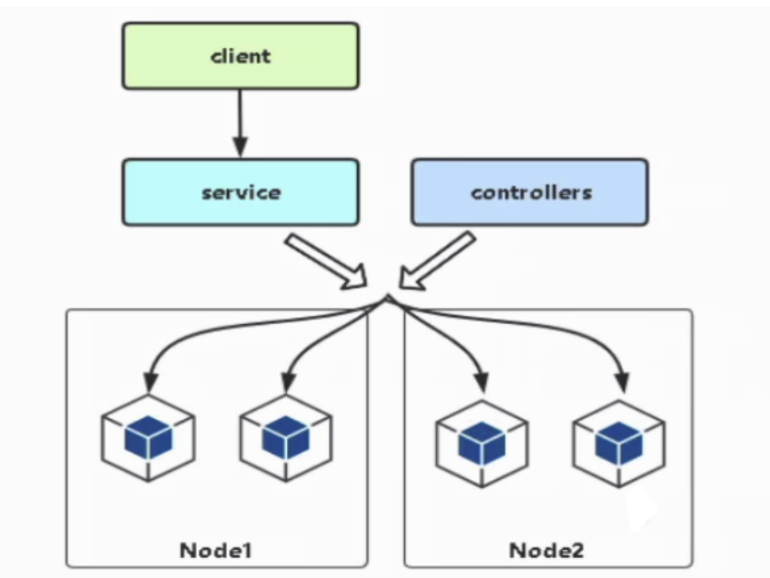
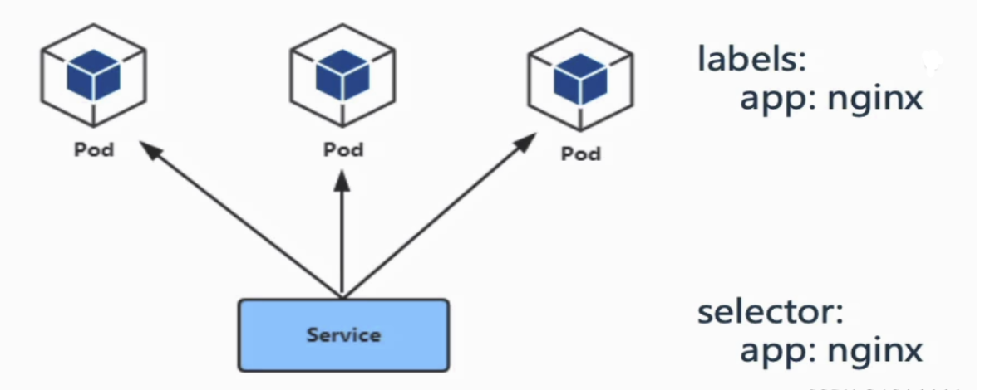
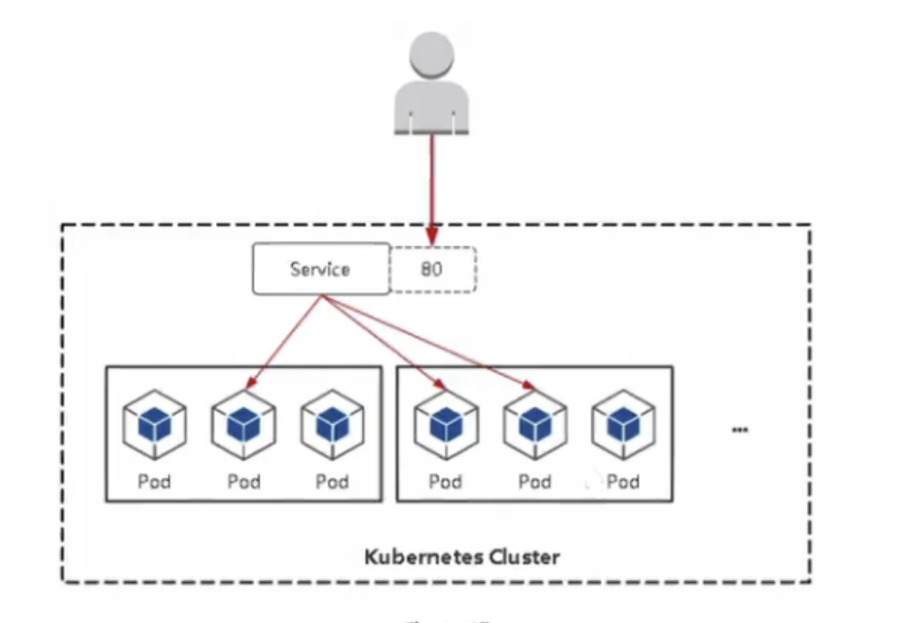
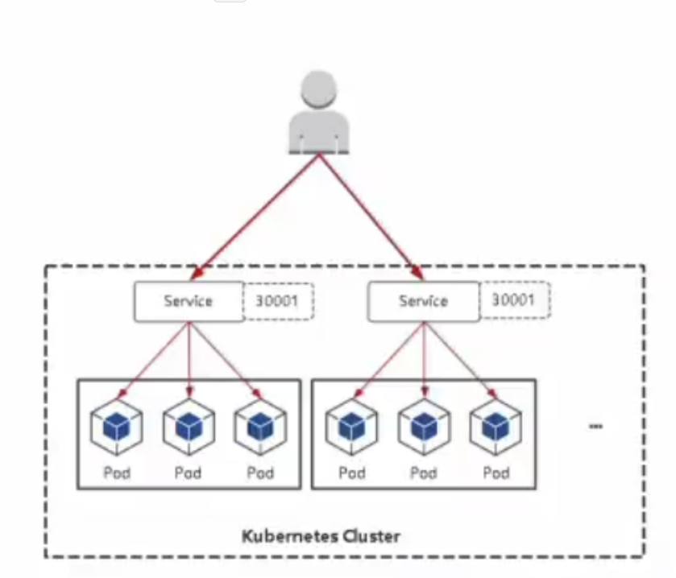
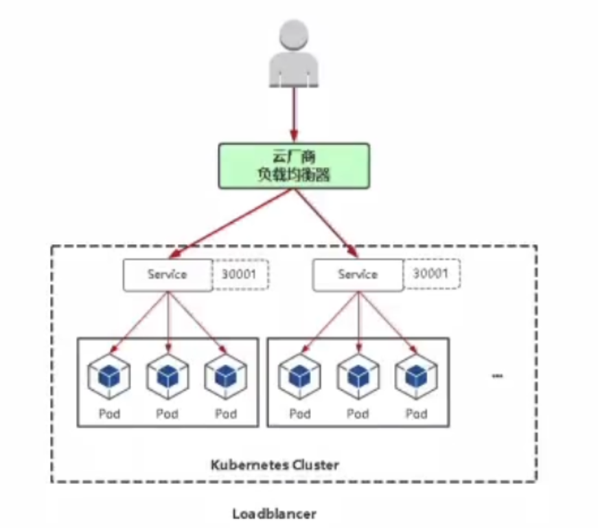

## Service是什么
- 其实就是k8s中的服务注册与负载均衡。
- 最终能够实现，提供一个唯一的地址，供我们来访问地址，而不需要具体的去了解，这个服务起的Pod的ip是什么

## Service存在的意义

### Service引入主要是解决Pod的动态变化,提供统一访问入口
- 防止Pod失联，准备找到提供同一个服务的Pod(服务发现)
- 定义一组Pod的访问策略(负载均衡)
   
   
### Pod与Service的关系
- Service通过标签关联一组Pod
- Service使用iptables或者ipvs为一组Pod提供负载均衡能力
   
## Service定义与创建
- 创建service
    
    
     kubectl apply -f service.yaml
- 查看service

    kubectl get service

### 自定义Service
- ClusterlP：默认，分配一个稳定的IP地址，即VIP，只能在集群内部访问。
  
    
 
 
    ---
    apiVersion: v1
    kind: Service
    metadata:
      name: web1
      namespace: default
    spec:
      ports:
      - port: 80		#Service端口
        protocol: TCP	#协议
        targetPort: 80	#容器端口
      selector:
        app: httpd		#指定关联Pod的标签
      type: ClusterIP	#服务类型
    ...					#文件结束用...

- NodePort：在每个节点上启用一个端口来暴露服务，可以在集群外部访问。也会分配一个稳定内部集群IP地址。
   访问地址：<任意NodelP> :<NodePort>
   端口范围：30000-32767
    
    
    
    
    ---
    apiVersion: v1
    kind: Service
    metadata:
      name: web1
      namespace: default
    spec:
      ports:
      - port: 80		#Service端口
        protocol: TCP	#协议
        targetPort: 80	#容器端口
        nodePort: 30000	#指定暴露端口号
      selector: 
        app: httpd		#指定关联Pod的标签
      type: NodePort	#服务类型
- LoadBalancer：与NodePort类似，在每个节点上启用一个端口来暴露服务。除此之外，Kubernetes会请求底层云平台（例如阿里云、腾讯云、AWS等)上的负载均衡器，将每个Node
([NodelP]:[NodePort])作为后端添加进去

    