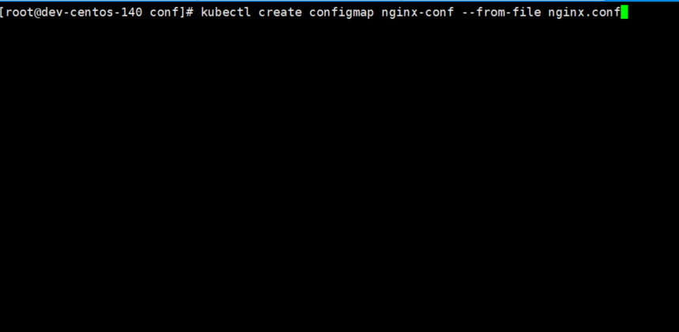
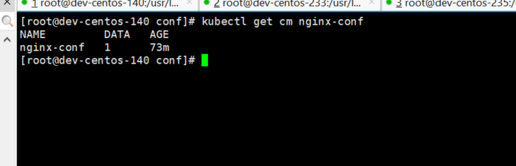
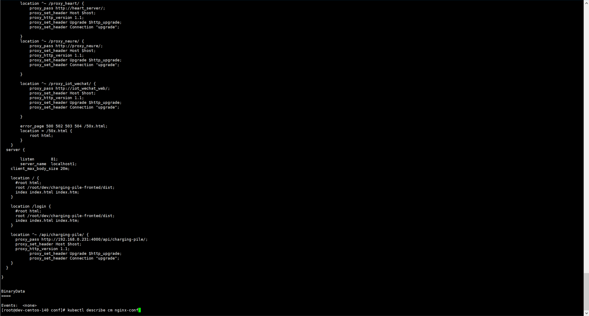
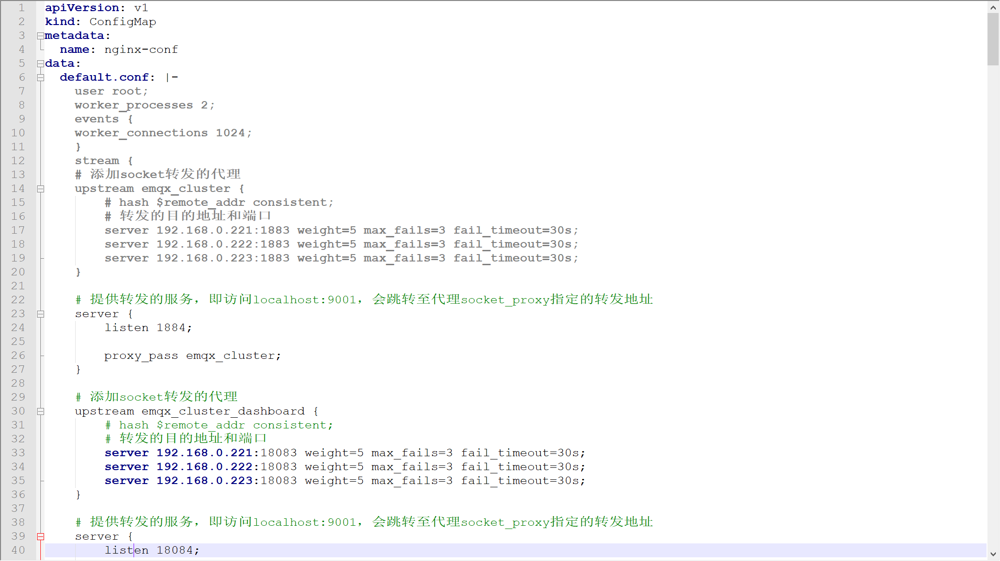

## ConfigMap介绍
ConfigMap是一种API对象，用来将非加密数据保存到键值对中。可以用作环境变量、命令行参数或者存储卷中的配置文件。

ConfigMap可以将环境变量配置信息和容器镜像解耦，便于应用配置的修改。如果需要存储加密信息时可以使用Secret对象。

## ConfigMap创建

### 通过命令行创建configmap
可以使用 kubectl create configmap 从文件、目录或者 key-value 字符串创建等创建 ConfigMap

  
   
查看创建的configMap
 
 
查看configMap的详细信息
 
 
### 通过yaml文件创建
   
   
   
    kubectl create -f nginx-config.yaml
   
## ConfigMap的使用

Pod的使用方式：
- 将ConfigMap中的数据设置为容器的环境变量

- 将ConfigMap中的数据设置为命令行参数

- 使用Volume将ConfigMap作为文件或目录挂载

- 编写代码在 Pod 中运行，使用 Kubernetes API 来读取 ConfigMap

    apiVersion: apps/v1    #与k8s集群版本有关，使用 kubectl api-versions 即可查看当前集群支持的版本
    kind: Deployment    #该配置的类型，我们使用的是 Deployment
    metadata:            #译名为元数据，即 Deployment 的一些基本属性和信息
      name: nginx-deployment    #Deployment 的名称
      labels:        #标签，可以灵活定位一个或多个资源，其中key和value均可自定义，可以定义多组，目前不需要理解
        app: nginx    #为该Deployment设置key为app，value为nginx的标签
    spec:            #这是关于该Deployment的描述，可以理解为你期待该Deployment在k8s中如何使用
      replicas: 1    #使用该Deployment创建一个应用程序实例
      selector:        #标签选择器，与上面的标签共同作用，目前不需要理解
        matchLabels: #选择包含标签app:nginx的资源
          app: nginx
      template:        #这是选择或创建的Pod的模板
        metadata:    #Pod的元数据
          labels:    #Pod的标签，上面的selector即选择包含标签app:nginx的Pod
            app: nginx
        spec:        #期望Pod实现的功能（即在pod中部署)
          containers:
          - name: nginx
            image: nginx
            ports:
              - containerPort: 80   #内部服务暴露的端口
            volumeMounts:
            - name: config-volume
              mountPath: /etc/nginx/nginx.conf
              subPath: nginx.conf
          volumes:
          - name: config-volume
            configMap:
              name: nginx-conf                            
 
 注意：
    
  ConfigMap必须在Pod使用它之前创建
    
  使用envFrom时，将会自动忽略无效的键
    
  Pod只能使用同一个命名空间的ConfigMap