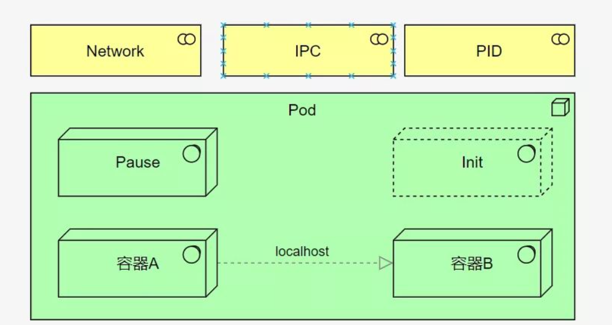
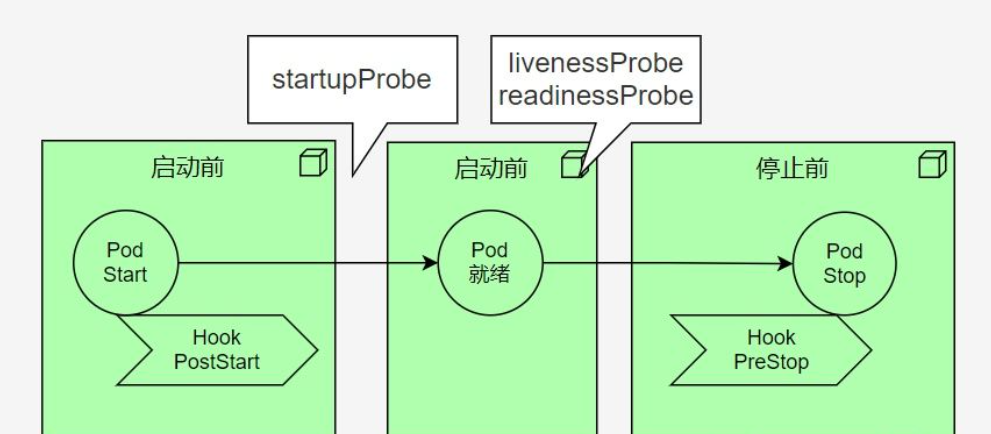
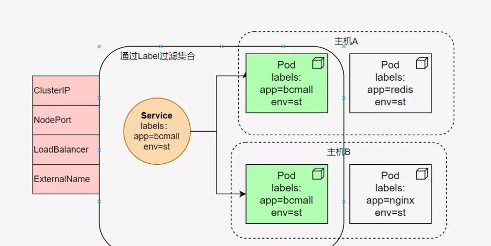
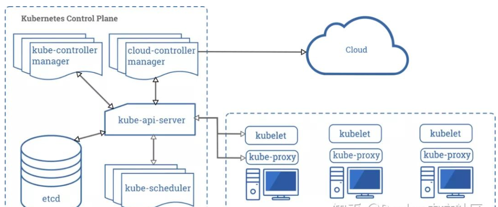
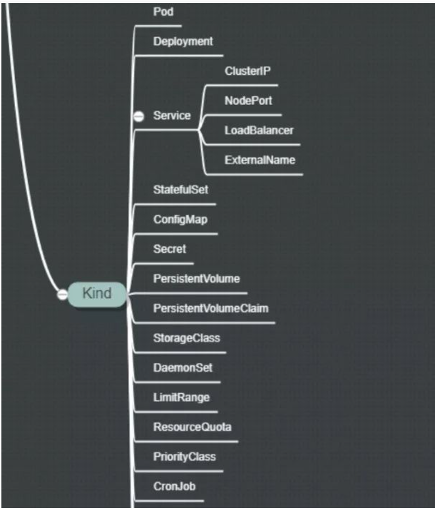

要弄明白k8s的细节，需要知道k8s是个什么东西。它的主要功能，就是容器的调度--也就是把部署实例，根据整体资源的使用状况，部署到任何地方。先不要扯别的，那会扰乱视线，增加复杂性。

注意任何这两个字，预示着你并不能够通过常规的IP、端口方式访问部署的实例。复杂性由此而生。

我们学k8s，就要看它要调度哪些资源。以传统的感觉来看，无非就是cpu、内存、网络、io等。在了解怎么对这些资源调度之前，先要搞懂什么叫Pod，这可是k8s的核心概念之一。

搞不懂Pod，就没法玩k8s。

## Pod
pod是k8s调度的最小单元，包含一个或者多个容器（这里的容器你可以暂时认为是docker）。

Pod拥有一个唯一的IP地址，在包含多个容器的时候，依然是拥有一个IP地址，它是怎么办到的呢

k8s在使用多个容器的时候，用到的就是共享namespace，这样Pod里的容器就可以通过localhost通信了，就像两个进程一样。同理的，Pod 可以挂载多个共享的存储卷（Volume），这时内部的各个容器就可以访问共享的 Volume 进行数据的读写。

一些边车(Sidecar)，以及存活探针等，也是以容器的形式，存在于Pod中的。所以Pod是一个大杂烩，它取代了docker容器的一部分工作，比如创建一些共享的net namespace等。

那如何表示、声明一个Pod呢？又如何指定这些容器与Pod的关系呢？k8s选用了yaml这种配置方式，初衷是避免过度的API设计。

很好，这又引入了另外一个问题，那就是yml文件的膨胀。所有的k8s运维，都有过被yml文件给支配的恐惧。

没有银弹，只不过把问题转移到另外一个场景罢了。

声明一个Pod，就是写yml文件。一个Pod的yml样例，可能长得像下面这样。

        apiVersion: v1           #本版号
        kind: Service            #创建的资源类型
        metadata:                #元数据必选
          namespace: bcmall      #绑定命名空间
          name: bcmall-srv       #Service资源名称
        spec:                    #定义详细信息
          type: NodePort         #类型
          selector:              #标签选择器
            app: container-bcmall-pod 
          ports:                 #定义端口
            - port: 8080         #port 指定server端口,此端口用于集群内部访问
              targetPort: 80     #绑定pod端口
              nodePort: 14000    #将server 端口映射到Node节点的端口,用于外网访问
              protocol: TCP      #端口协议
注意kind这个选项，这将是k8s概念膨胀的噩梦！k8s的各种配置，基本上都是围着这里转。哦对了，要让这些yml文件生效，你需要用到kubectl 命令，就像这样。      

        
        kubectl create -f kubernetes-iot-firesafety-web
        
访问一个Pod，可以通过它的IP，也可以通过内部的域名（这时候就需要CoreDNS）。当这么用的时候，其实Pod的表现，就相当于一台普通的机器，里面的容器就是一堆进程而已
        
## 探针和钩子
一个Pod被调度之后，就要进行初始化。初始化肯定是得有一个反馈的，否则都不知道最终有没有启动成功。这些健康检查的功能，叫做探针（Probe），一个比较怪异的英文名词。

常见的有livenessProbe、readinessProbe、startupProbe等三种探针。

livenessProbe有点像心跳，如果判定不在线了，就会把它干掉；readinessProbe一般表示就绪状态，也比较像心跳，证明你的服务在正常跑着；startupProbe用于判断容器是否已经启动好，避免一些超时等，比如你的JVM启动完毕了，才能对外提供服务。

一般，花费120s startupProbe的启动实践，每隔5s检测一下livenessProbe，每隔10s检测一下readinessProbe,是常用的操作。

这些信息，也是在yml中配置的，具体的配置层次如何，这里不罗嗦，您就查文档去吧。

再说一下钩子（Hook）。主要有PostStart和PreStop两种。PostStart 可以在容器启动之后就执行，PreStop 则在容器被终止之前被执行。这没什么神奇的，就是执行一些shell脚本而已，只不过比较常用，就提升到了关键字的级别。

## 高可用引起的名词爆炸
上面说到，yaml的复杂性，是由于kind的种类多所引起的。首先我们要接触的，就是ReplicaSet。
我们需要多个副本，才能做高可用。
原因很简单，一个Pod就相当于一台机器，当掉之后，就无法提供服务了，这是哪门子的高可用？所以对等的Pod，要有多份才行。

ReplicaSet简称RS，可以让你的Pod数量一直保持在某个水平。但它在操作起来还是有点麻烦了，所以一般使用更加高级的Deployment。Deployment可以实现一些滚动升级的需求，但前提是你需要在spec.template.metadata.labels中设置了相应的键值对。

k8s的一些过滤工作，都是通过labels来实现的。这其实是一种非常折衷的做法，因为它本身并没有做一些类似于sql查询之类的工作，就只能在这一堆map的键值对上做文章。比如这样：

        kubectl get pod -n demo -l app=nginx,version=v1

是不是很魔幻的写法？不要紧，习惯了就好了。

这些yml配置，通常都是一环套一环的，还会有交叉引用，所以也会有优先级。高阶的kind会直接顺带把低阶的kind一起创建了，属于一个级联关系。

一切不过是yml文件包了一层而已。

好了，我们要接触下一个kind：service了。

为什么需要Service？因为我们上面创建的Pod，哪怕是Deployment创建的Pod，你访问它都要费些功夫。虽然Pod有IP，但如果它重启了，或者销毁了，IP就会动态变化。因为Pod是被调度的，它并不知道自己会被调度到哪一台机器。

Service这个东西，就是要提供一种非IP的访问途径，使得不论Pod在哪里，我们都能访问的到它。

如图所示，通过Labels的过滤，可以把多个Pod归结为一类，然后以某种类型对外暴露服务。Service说白了也是一个组合后的东西。
        
 对外访问的类型，这里要着重说明一下，因为它重要，所以要敲黑板。主要有4种：
- ClusterIP 创建一个虚拟的IP，唯一且不可修改。所有访问该IP的请求，都将被iptables转发到后端。这是默认的行为，就是一个coredns的插件
- NodePort 提供一个静态端口（NodePort）来暴露服务，主要使用的技术是NAT
- LoadBalancer LoadBalancer主要用于做外部的服务发现，即暴露给集群外部的访问
- ExternalName 使用较少，感兴趣的可以自行了解

但是等等。k8s是如何实现跨主机的Pod相互访问的呢？

在单个Node上的Pod相互访问可以理解，直接通过docker0网桥分配的IP，就可相互访问。

那k8s的底层网络是真么设置的呢？答案可能令人沮丧。k8s本身并不负责网络管理，也不为容器提供具体的网络设置，它是通过CNI（容器网络接口）来实现的。在不同的Node之上，不同的Pod访问就费了点劲，这正是CNI的工作。常用的CNI插件有：Flannel、Calico、Canal、Weave。

没错，又是一堆名词，而且各个都很难搞。

网络方面是k8s最复杂的知识点，框架也奇多，后面的文章会专门进行介绍。
## 内部组件
在开启更多的Kind之前，我们来看一下k8s的内部组件。

下面这张图，就是官网的一张图片，说明了k8s的一系列必要的组件。其中，etcd根本就不是这个体系里的，但k8s的一些持久化状态，需要有个地方存，就引入了这么一个组件，用来存储配置信息。
 
其中左半部分，是k8s自身的组件；右半部分，就在每个Node（也就是物理机）上的守护进程。它们的作用如下：
- kube-apiserver 提供Rest接口，属于k8s的灵魂，所有的认证、授权、访问控制、服务发现等功能，都通过它来暴露
- kube-scheduler 一看就是个调度组件，实际上它的作用也是这样。它会监听未调度的 Pod，实现你指定的目标
- kube-controller-manager 负责维护整个k8s集群的状态。注意是k8s集群的状态，它不管Pod
- kubelet 这是个守护进程，用来和apiserver通信，汇报自己Node的状态；一些调度命令，也是通过kubelet来接收执行任务
- kube-proxy kube-proxy其实就是管理service的访问入口,包括集群内Pod到Service的访问和集群外访问service。我们上面提到的四种模式，就是通过proxy进行转发的

这些组件的职责，已经是非常非常清楚了。难点还是在多种Kind概念上。
##  更多概念    

图中的这些概念，本质上都是在Pod之上，又包了一层。层次越高，功能越抽象，依赖的配置也越多。下面将挑主要的进行介绍。

- StatefulSet Deployment部署后的实例，它的id都是随机的，比如bcmall-deployment-5d45f98bd9，它是无状态的。与此对用的是StatefulSet，生成的实例名称是类似bcmall-deployment-1这样的。它具备固定的网络标记，比如主机名，域名等，可以按照顺序来部署和扩展，非常适合类似MySQL这样的实例部署
- DaemonSet 用于确保集群中的每一个节点只运行特定的pod副本，通常用于实现系统级后台任务
- configMap和Secret 顾名思义，就是做配置用的，因为容器或多或少会需要外部传入一些环境变量。可以用来实现业务配置的统一管理， 允许将配置文件与镜像文件分离，以使容器化的应用程序具有可移植性
- PV和PVC 业务运行就需要存储，可以通过PV进行定义。PV的生命周期独立于Pod的生命周期，就是一段网络存储；PVC是用户对于存储的需求：Pod消耗节点资源，PVC消耗PV资源，PVC和PV是一一对应的。没错，它们都是通过yml文件声明的
- **StorageClass ** 可以实现动态PV，是更进一步的封装
- Job 只要完成就立即退出，不需要重启或重建
- Cronjob 周期性任务控制，不需要持续后台运行

    
## 资源限制
很好，我们终于要聊一点资源限制方面的内容了。k8s的资源限制，仍然是通过cgroup来实现的。

k8s提供了requests和limits 两种类型参数对资源进行预分配和使用限制。

不要被这两个词给迷惑了。requests就相当于JVM参数中的-Xms，limits就相当于-Xmx。所以，如果你类比着把这两个值设置成一样的，是一种最佳的实践方式。

只是它的设置有点怪异

    requests:
     memory: "64Mi"
     cpu: "250m"
    limits:
     memory: "128Mi"
     cpu: "500m"
     
内存的单位是Mi，而cpu的单位是m，要多别扭有多别扭，但它是有原因的。

m是毫核的意思。比如，我们的操作系统有4核，把它乘以1000，那就是总CPU资源是4000毫核。如果你想要你的应用最多占用1/4核，那就设置成250m。

再来看内存，Mi是MiB的意思，我也搞不懂为啥不用MB，而使用Mi，可能是想让你印象深刻吧（MB和MiB还真不一样）。

若内存使用超出限制，会引发系统的OOM机制，但CPU不会，顶多会影响系统运行罢了。

k8s还提供了叫做LimitRange和ResourceQuota的Kind，用来限定CPU和Memory的申请范围，功能更加高级。

k8s最麻烦的有三点：

- yml文件概念爆炸
- 网络方案多样、复杂
- 权限、证书配置繁琐
搞懂了这三个方面，可以说玩转k8s就没问题了。

