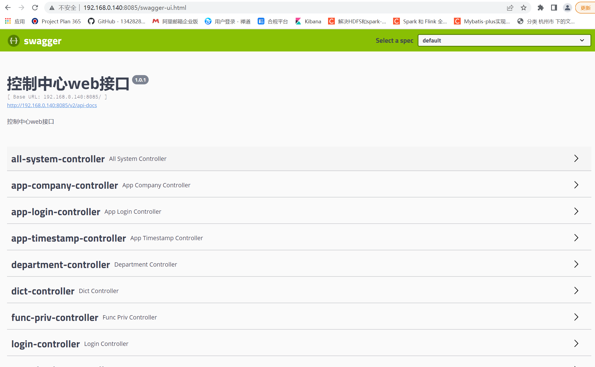

## 基于SpringBoot部署

### 引入dependency依赖

        <plugin>
				<groupId>com.spotify</groupId>
				<artifactId>dockerfile-maven-plugin</artifactId>
				<version>1.4.9</version>
				<executions>
					<execution>
						<id>default</id>
						<phase>${docker.build}</phase>
						<goals>
							<goal>build</goal>
							<goal>push</goal>
						</goals>
					</execution>
				</executions>
				<configuration>
					<repository>${docker.image.prefix}/${project.artifactId}</repository><!--注意不能有小写-->
					<tag>${project.version}</tag>
					<buildArgs>
						<JAR_FILE>${project.build.finalName}.jar</JAR_FILE>
					</buildArgs>
				</configuration>
			</plugin>

### 编写DockerFile文件

        FROM openjdk:8-jdk-alpine
        VOLUME /tmp
        ARG JAR_FILE
        COPY target/${JAR_FILE} /opt/app.jar
        ENTRYPOINT java ${JAVA_OPTS} -Duser.timezone=Asia/Shanghai -Dfile.encoding=UTF-8 -Djava.security.egd=file:/dev/./urandom -jar /opt/app.jar

### 镜像构建

        mvn clean package -pl com.fastech.framework:neure-server -am -Ddocker.build=package -Ddocker.image.prefix=192.168.0.234:23760

### docker文件配置
    vim /etc/docker/daemon.json
    
    {
      "registry-mirrors": ["http://f1361db2.m.daocloud.io"],
      "insecure-registries" : ["192.168.0.234:23760"]
    }

     vim docker.service
     
     [Unit]
     Description=Docker Application Container Engine
     Documentation=https://docs.docker.com
     BindsTo=containerd.service
     After=network-online.target firewalld.service containerd.service
     Wants=network-online.target
     Requires=docker.socket
     
     [Service]
     Type=notify
     # the default is not to use systemd for cgroups because the delegate issues still
     # exists and systemd currently does not support the cgroup feature set required
     # for containers run by docker
     #ExecStart=/usr/bin/dockerd -H fd:// --containerd=/run/containerd/containerd.sock
     ExecStart=/usr/bin/dockerd -H tcp://0.0.0.0:2376 -H unix:///var/run/docker.sock
     ExecReload=/bin/kill -s HUP $MAINPID
     TimeoutSec=0
     RestartSec=2
     Restart=always
     
     # Note that StartLimit* options were moved from "Service" to "Unit" in systemd 229.
     # Both the old, and new location are accepted by systemd 229 and up, so using the old location
     # to make them work for either version of systemd.
     StartLimitBurst=3
     
     # Note that StartLimitInterval was renamed to StartLimitIntervalSec in systemd 230.
     # Both the old, and new name are accepted by systemd 230 and up, so using the old name to make
     # this option work for either version of systemd.
     StartLimitInterval=60s
     
     # Having non-zero Limit*s causes performance problems due to accounting overhead
     # in the kernel. We recommend using cgroups to do container-local accounting.
     LimitNOFILE=infinity
     LimitNPROC=infinity
     LimitCORE=infinity
     
     # Comment TasksMax if your systemd version does not support it.
     # Only systemd 226 and above support this option.
     TasksMax=infinity
     
     # set delegate yes so that systemd does not reset the cgroups of docker containers
     Delegate=yes
     
     # kill only the docker process, not all processes in the cgroup
     KillMode=process
     
     [Install]
     WantedBy=multi-user.target
     
  

### 拉取推送的docker镜像
     
     
        docker pull 192.168.0.234:23760/scloud-auth:1.0.7
    

### 编写deployment部署云管

        apiVersion: apps/v1        ##版本号
        kind: Deployment           ##创建的资源类型
        metadata:                  ##元数据必选
          labels:                  ##标签
            app: kubernetes-scloud ##标签 app=kubernetes-scloud
          name: kubernetes-scloud  ##Deployment的名字
        spec:                      ##Pod的信息
          replicas: 2              ##Pod的副本数
          selector:                ##标签选择器
            matchLabels:           ##查找匹配的标签
              app: kubernetes-scloud ##app=kubernetes-scloud
          template:                ##Pod的模板信息，根据模板信息来创建Pod
            metadata:              ##Pod的元数据
              labels:              ##Pod的标签
                app: kubernetes-scloud ##标签app=kubernetes-scloud
            spec:                  ##容器的信息
              containers:          ##容器
              - image: 192.168.0.234:23760/scloud-auth:1.0.7  ##容器镜像
                name: scloud       ##容器名
                env:               ##容器环境变量
                 - name: JAVA_OPTS
                   value: -server -Xms128m -Xmx256m -Dserver.address=0.0.0.0 -Dserver.config-addr=192.168.0.234:18848  -Dserver.config-namespace=DEV_DOCKER
        
        
        
        kubectl create -f kubernetes-scloud.yaml
        
 ### 查看部署
    kubectl get deployment       
    kubectl get pod
    
    
### 配置service并提供外部接口访问

        apiVersion: v1
        kind: Service   ###该配置的类型，我们使用的是 Service 服务类型
        metadata:
          labels:
            app: kubernetes-scloud
          name: kubernetes-scloud
        spec:
          ports: #暴露的端口
          - port: 8085 #默认端口
            protocol: TCP
            nodePort: 8085  #内建服务的端口
            targetPort: 8085 #对外服务的端口
          selector:   #选中的app部署实例
            app: kubernetes-scloud
          type: NodePort #外网访问模式

        kubectl create -f kubernetes-scloud-service.yml

### 验证
浏览器登入配置的地址，访问成功
        