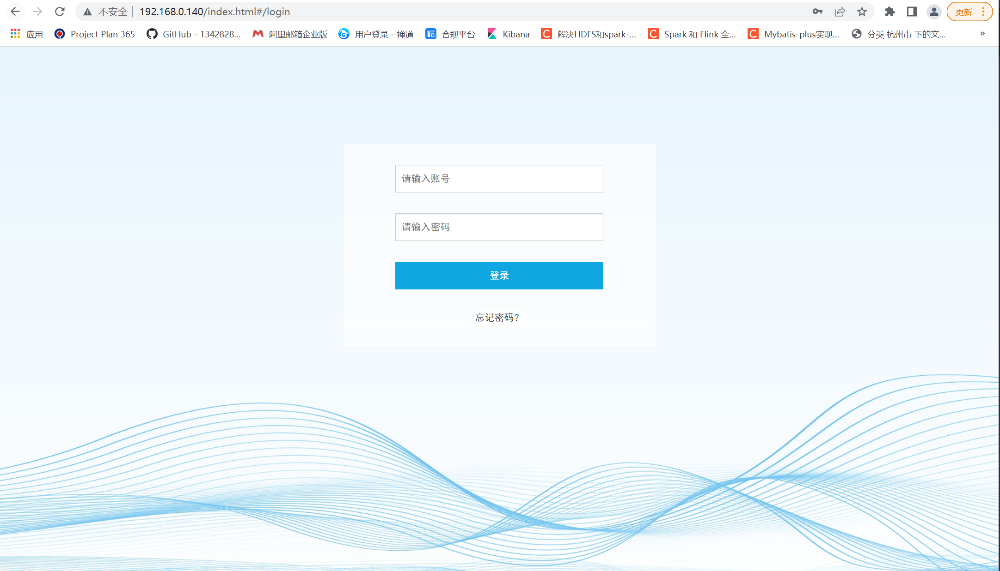

## nginx部署

### 拉取镜像 
     
        docker pull 192.168.0.234:23760/nginx
    

###将nginx配置文件作为配置引入k8s
        
        
        kubectl creaate configmap nginx-conf --from-file nginx.conf
        
###查看创建的configmap

        kubectl get cm nginx-conf        
###查看创建的详细信息
        
        
        kubectl describe cm nginx-conf

### 编写deployment部署nginx

        apiVersion: apps/v1    #与k8s集群版本有关，使用 kubectl api-versions 即可查看当前集群支持的版本
        kind: Deployment    #该配置的类型，我们使用的是 Deployment
        metadata:            #译名为元数据，即 Deployment 的一些基本属性和信息
          name: nginx-deployment    #Deployment 的名称
          labels:        #标签，可以灵活定位一个或多个资源，其中key和value均可自定义，可以定义多组，目前不需要理解
            app: nginx    #为该Deployment设置key为app，value为nginx的标签
        spec:            #这是关于该Deployment的描述，可以理解为你期待该Deployment在k8s中如何使用
          replicas: 1    #使用该Deployment创建一个应用程序实例
          selector:        #标签选择器，与上面的标签共同作用，目前不需要理解
            matchLabels: #选择包含标签app:nginx的资源
              app: nginx
          template:        #这是选择或创建的Pod的模板
            metadata:    #Pod的元数据
              labels:    #Pod的标签，上面的selector即选择包含标签app:nginx的Pod
                app: nginx
            spec:        #期望Pod实现的功能（即在pod中部署)
              containers:    
              - name: nginx    
                image: nginx  
                ports:
                  - containerPort: 80   #内部服务暴露的端口
                volumeMounts:  ##该容器引入confmap到容器里的路径
                - name: config-volume ##配置名
                  mountPath: /etc/nginx/nginx.conf ##覆盖路径
                  subPath: nginx.conf  ##子路径，这里不写会进行全覆盖
              volumes:
              - name: config-volume ##配置名
                configMap: 
                  name: nginx-conf ##confmap的名字

        
        kubectl create -f nginx-deployment.yaml
        
 ### 查看部署
    kubectl get deployment       
    kubectl get pod
    
    
### 配置service并提供外部接口访问

        apiVersion: v1
        kind: Service  #该配置的类型，我们使用的是 Service 服务类型
        metadata:
          name: nginx-service  #该服务类型的名称
        spec:
          selector:    #选中的app部署实例
            app: nginx #为该Deployment设置key为app，value为nginx的标签
          ports:  #暴露的端口
          - protocol: TCP  # 走得tcp 协议
            port: 80 #默认端口
            targetPort: 80 #内建服务端口
            nodePort: 80 #对外服务端口
          type: NodePor

        kubectl create -f kubernetes-nginx-service.yml

### 
浏览器登入配置的地址，访问成功
        